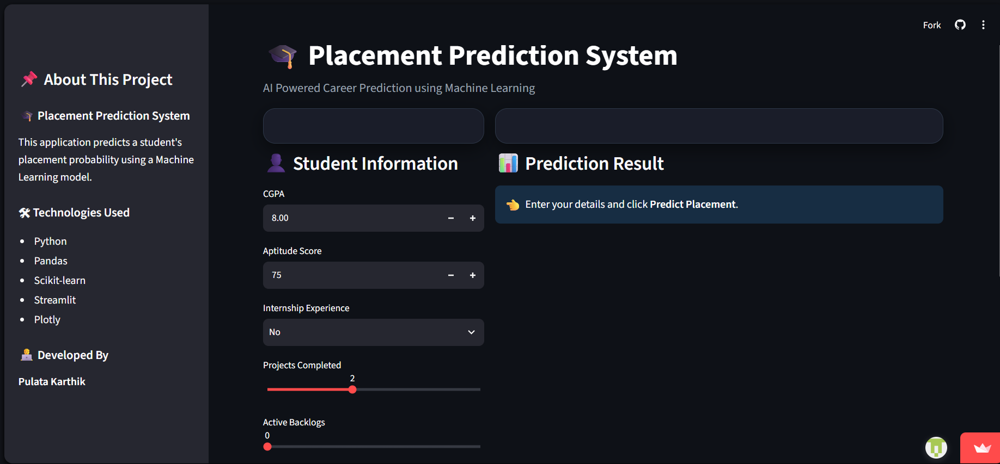
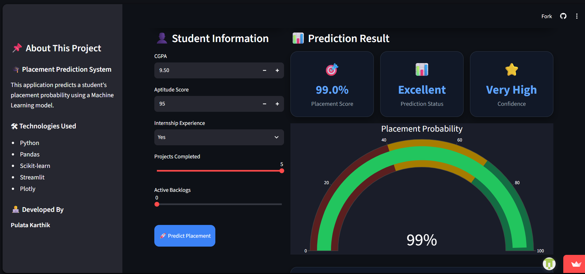
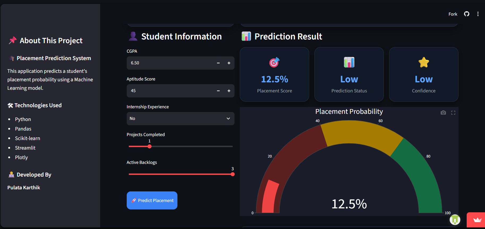

# 🎓 Placement Prediction System

An end-to-end Machine Learning web application that predicts a student's placement probability based on academic and career-related factors.

## 🚀 Live Demo

🔗 **Try the application:** https://pulatakarthik-placement-prediction-srcapp-10rvsw.streamlit.app/

---

## 📌 Features

- 🎯 Predicts placement probability
- 📊 Interactive dashboard
- 📈 Beautiful gauge visualization
- 💡 AI-based recommendations
- 👤 Student summary
- 🌐 Deployed using Streamlit Community Cloud

---

## 🛠️ Technologies Used

- Python
- Pandas
- NumPy
- Scikit-learn
- Streamlit
- Plotly
- Joblib
- Git & GitHub

---

## 📸 Application Screenshots

### 🏠 Home Screen



### 📊 High Placement Prediction



### 📉 Low Placement Prediction



---

## 📂 Project Structure

```text
placement-prediction/
│
├── assets/
├── data/
├── models/
├── src/
├── README.md
├── requirements.txt
└── .gitignore
```

---

## ⚙️ Installation

Clone the repository:

```bash
git clone https://github.com/pulatakarthik/placement-prediction.git
```

Install dependencies:

```bash
pip install -r requirements.txt
```

Run the application:

```bash
streamlit run src/app.py
```

---

## 🤖 Machine Learning Model

- Model: Random Forest Classifier
- Features Used:
  - CGPA
  - Aptitude Score
  - Internship Experience
  - Projects Completed
  - Active Backlogs

---

## 📈 Future Improvements

- Real-world dataset
- Resume analysis
- Company-wise prediction
- Student login system
- Performance analytics

---

## 👨‍💻 Author

**Karthik Pulata**

GitHub:
https://github.com/pulatakarthik